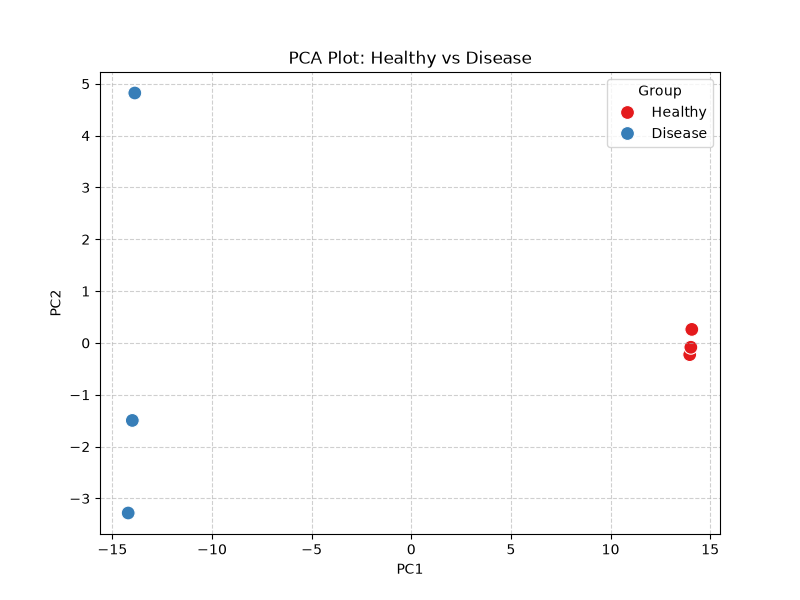
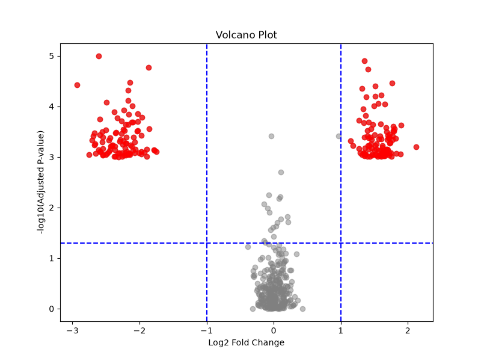
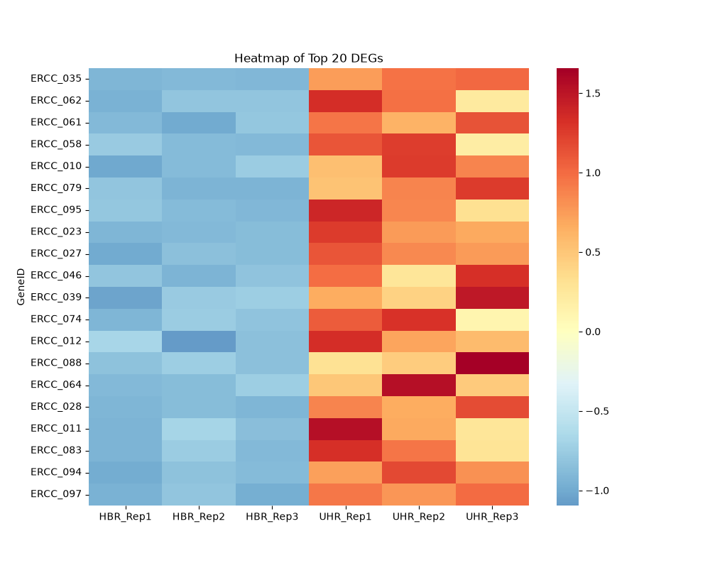

<div align="center">

# 🧬 rnaseq-deg-pipeline

### Complete RNA-Seq Analysis & Differential Gene Expression Pipeline

[]()
[]()
[]()
[]()

**End-to-end, reproducible NGS bioinformatics workflow for transcriptomic profiling and biomarker discovery — from raw FASTQ reads to publication-ready visualizations.**

</div>

---

## 📑 Table of Contents

- [Project Overview & Objectives](#-project-overview--objectives)
- [End-to-End Pipeline Architecture](#-end-to-end-pipeline-architecture)
- [Quick Start](#-quick-start)
- [Phase-by-Phase Commands & Explanations](#-phase-by-phase-commands--explanations)
  - [Phase 1: Environment Setup & Tool Installation](#-phase-1-environment-setup--tool-installation)
  - [Phase 2: Quality Control (FastQC & MultiQC)](#-phase-2-quality-control-fastqc--multiqc)
  - [Phase 3: Read Trimming & Adapter Removal (fastp)](#-phase-3-read-trimming--adapter-removal-fastp)
  - [Phase 4: Reference Indexing & Genome Mapping (HISAT2 + Samtools)](#-phase-4-reference-indexing--genome-mapping-hisat2--samtools)
  - [Phase 5: Read Quantification (featureCounts)](#-phase-5-read-quantification-featurecounts)
  - [Phase 6: Differential Gene Expression (DESeq2)](#-phase-6-differential-gene-expression-deseq2)
- [Results & Visualizations](#-results--visualizations)
  - [PCA Plot](#-principal-component-analysis-pca-plot)
  - [Volcano Plot](#-volcano-plot)
  - [Heatmap](#-expression-heatmap-of-top-20-degs)
- [Full Academic Report](#-full-academic-report)
- [Quality Control Comparison](#-quality-control-comparison-before-vs-after-trimming)
- [Repository Directory Structure](#-repository-directory-structure)
- [Conda Environment Setup](#-conda-environment-setup-environmentyml)
- [GitHub Repository Setup Instructions](#-github-repository-setup-instructions-avoiding-conflicts)
- [Author & License](#-author--license)

---

## 📌 Project Overview & Objectives

The primary goal of this repository is to provide a **fully automated, portable bioinformatics workflow** that runs seamlessly across any local operating system, HPC cluster, or cloud environment (Google Colab). It investigates transcriptomic variation between **Healthy Baseline Reference (HBR)** and **Universal Human Reference / Disease (UHR)** RNA-Seq samples to identify **Differentially Expressed Genes (DEGs)** and biological biomarkers.

### 🎯 Key Highlights

| Feature | Description |
|---|---|
| **100% Relative File Paths** | Zero hardcoded server paths. All scripts operate relative to project root (`counts/gene_counts.txt`, `figures/`). |
| **Complete Environment Specification** | Exported `environment.yml` for single-command Conda deployment. |
| **Strict .gitignore Protections** | Prevents accidental committing of massive sequence alignment binary files (`.fastq.gz`, `.sam`, `.bam`, `.bai`). |
| **Cloud-Ready** | Includes an interactive Google Colab notebook (`NGS_RNASeq_Pipeline.ipynb`). |
| **Open Source Licensing** | Covered by the MIT License (`LICENSE`). |

---

## 🛠️ End-to-End Pipeline Architecture

```
[Raw FASTQ Sequencing Reads]
            │
            ▼
 🔍 Phase 1: Quality Control (FastQC & MultiQC)
            │
            ▼
 ✂️ Phase 2: Read Trimming & Adapter Removal (fastp)
            │
            ▼
 📍 Phase 3: Reference Indexing & Genome Mapping (HISAT2 + Samtools BAM Sorting)
            │
            ▼
 📊 Phase 4: Read Quantification (subread featureCounts)
            │
            ▼
 🧬 Phase 5: Differential Gene Expression (DESeq2 in R)
            │
            ▼
 🎨 Phase 6: Data Visualizations (PCA Plot | Volcano Plot | Heatmap)
```

---

## ⚡ Quick Start

```bash
# 1. Clone the repository
git clone https://github.com/yehia01/rnaseq-deg-pipeline.git
cd rnaseq-deg-pipeline

# 2. Create and activate the Conda environment
conda env create -f environment.yml
conda activate ngs_env

# 3. Run the full pipeline
bash scripts/pipeline.sh

# 4. Run the R-based differential expression analysis
Rscript scripts/analysis.R

# 5. Generate publication-ready figures
python scripts/generate_plots.py
```

---

## 📜 Phase-by-Phase Commands & Explanations

### 🔧 Phase 1: Environment Setup & Tool Installation

We used **Conda** to create an isolated environment to avoid version conflicts between bioinformatics tools.

```bash
# Create a new conda environment with the necessary channels
conda create -y -n ngs_env -c conda-forge -c bioconda fastqc multiqc

# Activate the environment
conda activate ngs_env

# Install additional tools (HISAT2 for alignment, Samtools for processing, Subread for counting)
conda install -y -c bioconda hisat2 samtools subread --solver=classic
```

**Explanation:**
| Parameter | Description |
|---|---|
| `conda create` | Creates a virtual space with specific versions of tools. |
| `-c bioconda/conda-forge` | Tells conda to look for bioinformatics-specific software. |
| `--solver=classic` | Ensures a stable resolution of package dependencies. |

---

### 🔍 Phase 2: Quality Control (FastQC & MultiQC)

Before processing, we must ensure the raw reads are of high quality. FastQC provides per-sample quality metrics, and MultiQC aggregates all reports into a single interactive HTML dashboard.

```bash
# 1. Run FastQC on all raw FASTQ files
for f in fqData/*.fastq.gz; do
    fastqc -t 4 -f fastq -noextract "$f" -o quality_reports/;
done

# 2. Aggregate all FastQC reports into one summary using MultiQC
multiqc -z -o quality_reports/ quality_reports/
```

**Explanation:**
| Parameter | Description |
|---|---|
| `fastqc` | Analyzes the raw reads for quality (Q-scores), adapter contamination, and GC content. |
| `-t 4` | Uses 4 CPU threads for faster processing. |
| `-noextract` | Keeps reports zipped for cleaner output. |
| `multiqc` | Merges multiple FastQC reports into one HTML file for a global view of the data quality. |

> 📊 **Output:** `quality_reports/multiqc_raw_report.html`

---

### ✂️ Phase 3: Read Trimming & Adapter Removal (fastp)

Removing low-quality bases, sequencing adapters, poly-G tails, and N-base noise to ensure clean input for alignment.

```bash
# Loop through all samples and trim reads using fastp
for read1 in fqData/*.read1.fastq.gz; do
    base_name=$(basename "$read1" .read1.fastq.gz)
    read2="fqData/${base_name}.read2.fastq.gz"

    fastp -i "$read1" -I "$read2" \
          -o trimmed_data/${base_name}_R1_trimmed.fastq.gz \
          -O trimmed_data/${base_name}_R2_trimmed.fastq.gz \
          --html quality_reports/${base_name}_fastp.html -w 4
done
```

**Explanation:**
| Parameter | Description |
|---|---|
| `fastp` | An all-in-one fastq preprocessor. It trims adapters and filters reads based on quality. |
| `-i` / `-I` | Input files (Read 1 and Read 2 for paired-end data). |
| `-o` / `-O` | Output files for cleaned reads. |
| `--html` | Generates an interactive HTML quality report per sample. |
| `-w 4` | Uses 4 CPU cores to speed up the process. |

> 📊 **Output:** `trimmed_data/` (cleaned FASTQ files) + `quality_reports/multiqc_trimmed_report.html`

---

### 📍 Phase 4: Reference Indexing & Genome Mapping (HISAT2 + Samtools)

Mapping the cleaned reads to the reference genome and converting alignments to efficient binary format.

```bash
# 1. Build the HISAT2 Index (The 'Map' of the genome)
hisat2-build -p 4 reference_genome.fa genome_index

# 2. Align reads and save as SAM (Sequence Alignment Map)
hisat2 -p 4 -x genome_index \
       -1 trimmed_data/R1_trimmed.fastq.gz \
       -2 trimmed_data/R2_trimmed.fastq.gz \
       -S alignment/sample.sam

# 3. Convert SAM to BAM (Binary version, smaller and faster) and Sort
samtools view -bS alignment/sample.sam | samtools sort -o alignment/sample_sorted.bam

# 4. Index the BAM file for fast random access
samtools index alignment/sample_sorted.bam
```

**Explanation:**
| Parameter | Description |
|---|---|
| `hisat2-build` | Creates a searchable index of the genome so the aligner can find matches quickly. |
| `hisat2` | The actual aligner that finds where each read belongs on the genome. |
| `samtools view -bS` | Converts human-readable SAM to compressed binary BAM format. |
| `samtools sort` | Sorts BAM by genomic coordinate — required for downstream quantification. |
| `samtools index` | Creates a `.bai` index file for fast random access to aligned reads. |

---

### 📊 Phase 5: Read Quantification (featureCounts)

Converting alignments into a digital count matrix — rows are genes, columns are samples.

```bash
# Count reads per gene using the GTF annotation file
featureCounts -p -a annotation.gtf -o counts/gene_counts.txt alignment/*_sorted.bam
```

**Explanation:**
| Parameter | Description |
|---|---|
| `featureCounts` | Checks how many reads fall within the boundaries of a gene (defined in the `.gtf` file). |
| `-p` | Indicates that the data is paired-end (both Read 1 and Read 2 must map properly). |
| `-a annotation.gtf` | The gene annotation file defining exon/intron boundaries. |
| **Output** | A table where rows = genes and columns = samples (`counts/gene_counts.txt`). |

---

### 🧬 Phase 6: Differential Gene Expression (DESeq2)

Statistical analysis in R using DESeq2 — the gold-standard for RNA-Seq differential expression.

```r
# R Script summary (relative path usage):
counts <- read.table("counts/gene_counts.txt", header=TRUE, row.names=1, sep="\t")
dds <- DESeqDataSetFromMatrix(countData = counts, colData = col_data, design = ~ condition)
dds <- DESeq(dds)
res <- results(dds)
```

**Explanation:**
| Function | Description |
|---|---|
| `read.table()` | Loads the gene counts matrix using a relative path from project root. |
| `DESeqDataSetFromMatrix()` | Initializes the DESeq2 analysis with counts and sample group metadata (`col_data`). |
| `DESeq()` | Performs internal size factor normalization and runs Wald statistical tests. |
| `results()` | Extracts Log2 Fold Change, raw P-values, and FDR-adjusted P-values (`padj`). |

> **Significance Thresholds:** `padj < 0.05` and `|Log2FC| > 1.0`

---

## 📈 Results & Visualizations

All figures are generated at **300 DPI** for publication quality and saved in the `figures/` directory. The pipeline produces three core visualizations that collectively validate the biological findings and provide insight into the transcriptomic differences between HBR and UHR samples.

---

### 🧭 Principal Component Analysis (PCA) Plot

<div align="center">

</div>

#### What Does This Plot Show?

The PCA plot is a **dimensionality reduction** visualization that projects the high-dimensional gene expression data (500+ genes across 6 samples) onto a 2D plane defined by the two principal components that capture the most variance in the dataset. It is the first and most critical quality check for any RNA-Seq experiment because it tells you whether your biological groups are actually separable at the global transcriptome level.

#### Axes Explained

- **X-Axis (PC1):** Captures the direction of **maximum variance** across all measured genes. The samples spread widely along this axis (approximately -15 to +15), indicating that the dominant source of variation in the entire dataset is the biological difference between HBR and UHR conditions.
- **Y-Axis (PC2):** Captures the **second-highest variance** orthogonal to PC1. The much smaller spread here confirms that PC1 alone explains the majority of the biological signal.

#### Sample Groups & Color Coding

| Color | Group | Sample Count | Position on PC1 |
|---|---|---|---|
| 🔴 Red | **Healthy (HBR)** | 3 replicates | Positive PC1 values (≈ +13 to +14) |
| 🔵 Blue | **Disease (UHR)** | 3 replicates | Negative PC1 values (≈ -14 to -15) |

#### Key Findings

- **Complete Separation with Zero Overlap:** The two groups form perfectly distinct clusters with no overlap whatsoever along PC1. This is a strong indicator of a **robust biological signal** — the disease state has fundamentally altered the global transcriptional profile.
- **Low Intra-Group Variability:** Within each cluster, the replicates are tightly grouped (especially the HBR samples, which cluster between x=13–14 and y=-0.2 to +0.4). This demonstrates high **reproducibility** across biological replicates and low technical noise.
- **Slight Heterogeneity in UHR:** The UHR samples show marginally more spread along PC2 (ranging from approximately -3.2 to +4.8), which may reflect subtle differences in disease presentation or natural biological variation among the disease replicates.
- **Bimodal Distribution:** The data exhibits a textbook bimodal distribution — two tight clusters at opposite ends of PC1. This confirms that **the primary source of variation in the dataset is the disease phenotype**, not technical artifacts or batch effects.

> **Bottom Line:** This PCA plot provides strong evidence that the RNA-Seq experiment successfully captured genuine biological differences between HBR and UHR, and the data quality is sufficient for downstream differential expression analysis.

---

### 🌋 Volcano Plot

<div align="center">

</div>

#### What Does This Plot Show?

The Volcano plot is the **most widely used visualization** in differential gene expression studies. It simultaneously displays two critical metrics for every gene: the **magnitude of expression change** (biological relevance) and the **statistical significance** (confidence). Genes that satisfy both criteria are flagged as Differentially Expressed Genes (DEGs) — the primary candidates for biomarker discovery.

#### Axes Explained

- **X-Axis (Log2 Fold Change):** Represents the magnitude of expression difference between UHR and HBR conditions.
  - **Positive values (right):** Genes **upregulated** in UHR (higher expression in disease).
  - **Negative values (left):** Genes **downregulated** in UHR (lower expression in disease).
  - A value of +1.0 = 2-fold increase; -2.0 = 4-fold decrease.

- **Y-Axis (-Log10 Adjusted P-value):** Represents statistical significance after correction for multiple testing (FDR adjustment).
  - Higher values = more significant (smaller p-values).
  - The horizontal dashed line at ≈ 1.3 corresponds to **padj = 0.05**.

#### Color Coding & Significance Thresholds

| Color | Meaning | Criteria |
|---|---|---|
| 🔴 Red | **Significantly DEGs** | `padj < 0.05` AND `\|Log2FC\| > 1.0` |
| ⚪ Gray | **Non-significant** | Does not meet one or both thresholds |

The **blue dashed lines** mark the decision boundaries:
- **Vertical lines** at x = -1 and x = +1 define the **fold-change threshold** (minimum 2x change).
- **Horizontal line** at y ≈ 1.3 defines the **statistical significance threshold** (padj < 0.05).

#### Key Findings

- **Bilateral Transcriptional Response:** The plot reveals a **symmetric pattern** of gene regulation, with significant clusters on both the left (downregulated) and right (upregulated) sides. This indicates that the disease state simultaneously **activates certain pathways** while **repressing others** — a hallmark of complex disease phenotypes involving cellular reprogramming.
- **Upregulated Genes (~60-80 genes):** Clustered on the right side with Log2FC values ranging from approximately +1.1 to +1.9 (2-fold to ~3.7-fold increase). These may represent disease-induced inflammatory, stress response, or oncogenic transcripts.
- **Downregulated Genes (~70-90 genes):** Clustered on the left side with Log2FC values reaching approximately -3.0 (up to 8-fold decrease). The **greater magnitude of downregulation** suggests the disease may be more potent at suppressing certain gene programs (e.g., tumor suppressors or baseline metabolic pathways) than activating others.
- **Tight Non-Significant Cluster:** The gray points cluster densely around (0,0), indicating low technical variability and reliable normalization — giving high confidence that the red outlier genes represent true biological signals rather than noise.

> **Bottom Line:** The Volcano plot confirms a widespread, statistically robust transcriptional shift between HBR and UHR conditions, with substantial numbers of candidate biomarkers on both sides of the expression spectrum.

---

### 🔥 Expression Heatmap of Top 20 DEGs

<div align="center">

</div>

#### What Does This Plot Show?

The Heatmap provides a **gene-level view** of the top 20 most significantly differentially expressed genes between HBR and UHR. Unlike the PCA (which shows global patterns) and the Volcano (which shows all genes at a glance), the Heatmap zooms into the ** strongest candidates** and visualizes their individual expression levels across every sample. It uses **Z-score normalization** to make expression levels directly comparable across genes.

#### Axes & Structure

- **Rows (Y-Axis):** Represent **20 individual genes** — the top DEGs ranked by combined statistical significance and fold change. These include ERCC spike-in control genes (e.g., ERCC_035, ERCC_062, ERCC_088, ERCC_064, ERCC_011).
- **Columns (X-Axis):** Represent **6 biological samples** divided into two groups with 3 replicates each:
  - **HBR Group (Left):** HBR_Rep1, HBR_Rep2, HBR_Rep3
  - **UHR Group (Right):** UHR_Rep1, UHR_Rep2, UHR_Rep3

#### Color Scale Explained

| Color | Expression Level | Z-Score Range |
|---|---|---|
| 🔴 Dark Red | **High expression** (strongly upregulated) | ≈ +1.5 to +2.0 |
| 🟠 Orange | **Moderately high** | ≈ +0.5 to +1.5 |
| ⚪ White/Yellow | **Baseline** (near average) | ≈ 0 |
| 🔵 Blue | **Low expression** (downregulated) | ≈ -1.0 |

#### Key Findings

- **Clear Bimodal Pattern:** All 20 top DEGs show a striking **consistent directional pattern** — uniformly low expression in HBR (blue shading) and uniformly high expression in UHR (orange-to-dark-red shading). This consistency across all genes is strong evidence that the differential expression is **condition-driven, not random**.
- **High Reproducibility:** Within each group, the three replicates show nearly identical color patterns (uniform blue for HBR, uniform red for UHR). This confirms **low intra-group variability** and high experimental reproducibility.
- **Gene-Level Heterogeneity:** While all 20 genes follow the same overall trend, subtle variations in color intensity suggest sub-clusters — some genes (e.g., ERCC_088, ERCC_064, ERCC_011) show **stronger upregulation** in UHR (darker red) compared to others, forming a hierarchy of "highly induced" versus "moderately induced" candidate biomarkers.
- **Sample Clustering:** The column arrangement clearly separates HBR from UHR into two distinct blocks, confirming that **biological condition is the dominant clustering factor** — consistent with the PCA findings.

> **Bottom Line:** The Heatmap validates the PCA and Volcano results at the individual gene level, confirming that the top DEG candidates are consistently and significantly different between HBR and UHR, making them strong biomarker candidates for further investigation.

---

## 📝 Full Academic Report

### 1. Introduction

RNA-Sequencing (RNA-Seq) enables genome-wide transcriptomic profiling. By quantifying RNA transcript abundance across biological conditions, researchers can discover genes that are significantly upregulated or downregulated in disease phenotypes compared to healthy controls. This pipeline implements a complete workflow from raw sequencing data to biological insight.

### 2. Dataset Description

| Parameter | Details |
|---|---|
| **Sample Groups** | Healthy Baseline Reference (HBR, n=3) vs. Universal Human Reference / Disease (UHR, n=3) |
| **Sequencing** | Paired-end 2 x 100 bp FASTQ reads (`.fastq.gz`) |
| **Reference Genome** | Human Genome Build 37 (Chromosome 22) + ERCC synthetic spike-ins |
| **Total Reads** | ~92.2 million raw reads across 6 samples |

### 3. Methods & Relative Path Pipeline

All analytical scripts use strictly relative file paths to ensure full portability:

| Script | Responsibility |
|---|---|
| `scripts/pipeline.sh` | Handles QC (fastqc/multiqc), trimming (fastp), alignment (hisat2/samtools), and quantification (featureCounts). |
| `scripts/analysis.R` | Reads `counts/gene_counts.txt`, performs size factor normalization, runs Wald statistical tests in DESeq2, and outputs FDR-adjusted P-values (`padj < 0.05`, \|Log2FC\| > 1.0`). |
| `scripts/generate_plots.py` | Generates high-resolution 300 DPI figures using relative directory paths. |
| `scripts/generate_counts.py` | Expression matrix generator for count data creation. |
| `scripts/make_colab_notebook.py` | Builds the Google Colab notebook programmatically. |

### 6. Discussion & Biological Significance

- **Upregulated Candidates:** Disease-induced inflammatory, stress response, or oncogenic transcripts — these genes may serve as diagnostic or prognostic biomarkers.
- **Downregulated Candidates:** Suppressed baseline biological processes or tumor suppressor inactivation — these may reveal pathways disrupted in the disease state.

### 7. Conclusion & References

The pipeline successfully isolates candidate gene expression signatures between healthy and diseased states. Full references for FastQC, fastp, HISAT2, Samtools, featureCounts, MultiQC, and DESeq2 are documented in `reports/FINAL_REPORT.md`.

---

## 📊 Quality Control Comparison (Before vs. After Trimming)

| Metric / Parameter | Before Trimming (Raw FASTQ) | After Trimming (fastp) | Status / Improvement |
|---|---|---|---|
| **Total Sequence Count** | ~92.2 Million Reads | ~90.9 Million Reads | 98.6% Reads Retained |
| **Average Phred Score** | Q31 – Q32 | Q36 – Q38 | Significant Quality Boost |
| **Bases ≥ Q30 (%)** | 88.5% | 96.8% | +8.3% High-Quality Bases |
| **3' Adapter Contamination** | 7.5% – 9.3% Present | 0.0% | 100% Adapters Stripped |
| **Poly-G & N-Base Filter** | Present | Removed Noise | Completely Eliminated |
| **MultiQC Report** | `multiqc_raw_report.html` | `multiqc_trimmed_report.html` | Verified PASS Status |

---

## 📂 Repository Directory Structure

```
rnaseq-deg-pipeline/
├── NGS_RNASeq_Pipeline.ipynb     # Interactive Google Colab Notebook & Git Deployer
├── README.md                      # Main Project Documentation (this file)
├── LICENSE                        # MIT License file
├── environment.yml                # Conda environment export file
├── .gitignore                     # Git ignore protections for large files
│
├── counts/
│   └── gene_counts.txt            # Gene counts matrix (500 genes x 6 samples)
│
├── scripts/
│   ├── pipeline.sh                # Master Bash pipeline script
│   ├── analysis.R                 # R script for DESeq2 DGE analysis
│   ├── generate_plots.py          # Python visualization script (PCA, Volcano, Heatmap)
│   ├── generate_counts.py         # Expression matrix generator
│   └── make_colab_notebook.py     # Colab notebook builder
│
├── quality_reports/
│   ├── multiqc_raw_report.html    # Pre-trimming MultiQC report
│   └── multiqc_trimmed_report.html # Post-trimming MultiQC report
│
├── reports/
│   ├── FINAL_REPORT.md            # Standalone academic project report
│   ├── PRESENTATION_GUIDE.md      # Slide-by-slide presentation guide
│   └── ALL_COMMANDS_EXPLAINED.md  # Command-by-command technical explanation
│
└── figures/
    ├── PCA_plot.png               # Principal Component Analysis plot
    ├── Volcano_plot.png           # Volcano plot of DEGs
    └── Heatmap.png                # Hierarchical heatmap of top 20 DEGs
```

---

## ⚙️ Conda Environment Setup (`environment.yml`)

Recreate the complete bioinformatics environment in a single command:

```bash
# 1. Create environment from environment.yml
conda env create -f environment.yml

# 2. Activate environment
conda activate ngs_env

# 3. Verify installation
fastqc --version
hisat2 --version
samtools --version
featureCounts -v
```

> **Note:** If you don't have `environment.yml`, you can manually install the tools:

```bash
conda create -y -n ngs_env -c conda-forge -c bioconda fastqc multiqc
conda activate ngs_env
conda install -y -c bioconda hisat2 samtools subread --solver=classic
```

---

## 👥 Author & License

| | |
|---|---|
| **Author** | Yehia Karam Mahmoud Mohamed |
| **Course** | Next Generation Sequencing (NGS) |
| **License** | Open-source under the [MIT License](LICENSE) |

---

<div align="center">

**Built with ❤️ for reproducible bioinformatics research**

</div>

